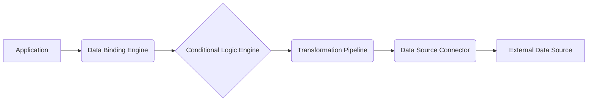

# Data Sources Integration Guide

**Description:** This document provides comprehensive information on the `data_sources` module, covering its architecture, data flow, and integration patterns. It is intended for developers and system integrators who need to understand and work with the data sources functionality.

**Target Audience:** Intermediate Developers, Advanced Developers, System Integrators

## Introduction to Data Sources

The `data_sources` module provides a flexible and extensible mechanism for connecting to and retrieving data from various external sources. It abstracts the complexities of data access, allowing developers to focus on using the data within their applications. Key features include:

*   **Abstraction:** Hides the underlying details of data access, providing a consistent interface.
*   **Flexibility:** Supports a wide range of data source types (e.g., databases, APIs, files).
*   **Extensibility:** Allows for the creation of custom data source connectors.
*   **Data Transformation:** Enables data manipulation and formatting before it's consumed.
*   **Conditional Logic:** Supports dynamic data retrieval based on specific conditions.

This guide will walk you through the architecture, data binding, transformations, and conditional logic involved in using the `data_sources` module effectively.

## Data Source Architecture

The `data_sources` module follows a modular architecture, consisting of the following key components:

*   **Data Source Connector:**  Responsible for establishing a connection to the external data source and retrieving data.  Each data source type (e.g., REST API, SQL database) has its own connector implementation.
*   **Data Source Definition:**  A configuration object that specifies the data source type, connection details, and any required parameters.
*   **Data Binding Engine:**  Maps data from the data source to application-specific data structures.
*   **Transformation Pipeline:**  Applies a series of transformations to the data before it's consumed.
*   **Conditional Logic Engine:**  Determines which data to retrieve or how to transform it based on predefined conditions.



**Data Flow:**

1.  The application requests data through the Data Binding Engine.
2.  The Data Binding Engine evaluates any conditional logic.
3.  Based on the conditions, the Transformation Pipeline is configured.
4.  The Data Source Connector retrieves data from the External Data Source.
5.  The Transformation Pipeline transforms the data.
6.  The Data Binding Engine maps the transformed data to the application's data structures.
7.  The application receives the data.

## Data Binding

Data binding is the process of mapping data from a data source to application-specific data structures. This involves specifying which fields from the data source should be mapped to which properties in the application.

**Example:**

Let's say we have a data source that returns JSON data representing a user:

```json
{
  "id": 123,
  "name": "John Doe",
  "email": "john.doe@example.com"
}
```

We can bind this data to a `User` object in our application:

```python
class User:
  def __init__(self, id, name, email):
    self.id = id
    self.name = name
    self.email = email

# Data binding configuration (example)
binding_config = {
  "id": "id",
  "name": "name",
  "email": "email"
}

# Assuming 'data' is the JSON data from the data source
data = {
  "id": 123,
  "name": "John Doe",
  "email": "john.doe@example.com"
}

# Create a User object using the data binding configuration
user = User(id=data[binding_config["id"]], name=data[binding_config["name"]], email=data[binding_config["email"]])

print(f"User ID: {user.id}, Name: {user.name}, Email: {user.email}")
```

## Data Transformations

Data transformations allow you to manipulate and format data before it's consumed by the application. This can include:

*   **Data Type Conversion:** Converting data from one type to another (e.g., string to integer).
*   **Data Formatting:** Formatting data according to specific requirements (e.g., date formatting).
*   **Data Aggregation:** Combining data from multiple sources or fields.
*   **Data Filtering:** Selecting specific data based on certain criteria.

**Example:**

Let's say we have a data source that returns a date in the format "YYYY-MM-DD", but our application requires it in the format "MM/DD/YYYY". We can use a data transformation to convert the date:

```python
from datetime import datetime

def transform_date(date_string):
  """Converts a date string from YYYY-MM-DD to MM/DD/YYYY."""
  date_object = datetime.strptime(date_string, "%Y-%m-%d")
  return date_object.strftime("%m/%d/%Y")

# Example usage
date_string = "2023-10-27"
transformed_date = transform_date(date_string)
print(f"Original date: {date_string}, Transformed date: {transformed_date}")
```

This transformation can be integrated into the data binding process.

## Conditional Logic

Conditional logic allows you to dynamically retrieve or transform data based on specific conditions. This can be useful for:

*   **Filtering data based on user roles or permissions.**
*   **Retrieving different data based on the current date or time.**
*   **Applying different transformations based on the data source type.**

**Example:**

Let's say we want to retrieve different data based on the user's role. If the user is an administrator, we retrieve all data. Otherwise, we only retrieve data that is relevant to their role.

```python
def get_data(user_role):
  """Retrieves data based on the user's role."""
  if user_role == "administrator":
    # Retrieve all data
    data = get_all_data()
  else:
    # Retrieve data relevant to the user's role
    data = get_role_specific_data(user_role)
  return data

def get_all_data():
  """Retrieves all data."""
  # Implementation details
  return {"message": "All data retrieved"}

def get_role_specific_data(user_role):
  """Retrieves data relevant to the user's role."""
  # Implementation details
  return {"message": f"Data retrieved for role: {user_role}"}

# Example usage
user_role = "administrator"
data = get_data(user_role)
print(data)

user_role = "editor"
data = get_data(user_role)
print(data)
```

## Implementation Examples

This section provides practical examples of how to integrate the `data_sources` module into your applications.

**Example 1: Fetching data from a REST API**

```python
import requests

def fetch_data_from_api(api_url):
  """Fetches data from a REST API."""
  try:
    response = requests.get(api_url)
    response.raise_for_status()  # Raise HTTPError for bad responses (4xx or 5xx)
    return response.json()
  except requests.exceptions.RequestException as e:
    print(f"Error fetching data from API: {e}")
    return None

# Example usage
api_url = "https://jsonplaceholder.typicode.com/todos/1" # Example public API
data = fetch_data_from_api(api_url)

if data:
  print(f"Data from API: {data}")
```

**Example 2: Reading data from a CSV file**

```python
import csv

def read_data_from_csv(csv_file_path):
  """Reads data from a CSV file."""
  data = []
  try:
    with open(csv_file_path, 'r') as csvfile:
      reader = csv.DictReader(csvfile)
      for row in reader:
        data.append(row)
    return data
  except FileNotFoundError:
    print(f"Error: CSV file not found at {csv_file_path}")
    return None
  except Exception as e:
    print(f"Error reading CSV file: {e}")
    return None

# Example usage
csv_file_path = "data.csv" # Replace with your CSV file path

# Create a sample data.csv file for testing
with open(csv_file_path, 'w', newline='') as csvfile:
    fieldnames = ['id', 'name', 'email']
    writer = csv.DictWriter(csvfile, fieldnames=fieldnames)

    writer.writeheader()
    writer.writerow({'id': '1', 'name': 'Alice', 'email': 'alice@example.com'})
    writer.writerow({'id': '2', 'name': 'Bob', 'email': 'bob@example.com'})


data = read_data_from_csv(csv_file_path)

if data:
  print(f"Data from CSV: {data}")
```

**Related Endpoints:**

*   `/data-sources`:  API endpoint for managing data source definitions.
*   `/data-bindings`: API endpoint for managing data binding configurations.
